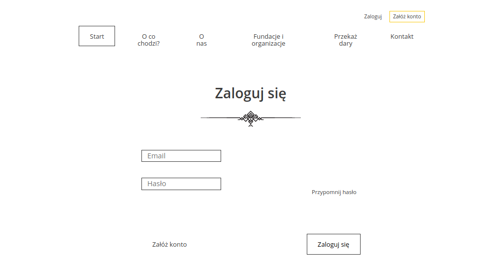

# CharityDonation

## Description:
The application allows you to collect information about donors, who want help and also can donate unnecessary things to trusted institutions.

## Technologies:
* Python
* JavaScript
* Django
* PostgreSQL
* HTML5
* CSS3

## Applications inside:
* **accounts** for accounts management.
* **donation** for donation management.

## Layout:
#### Accounts:

#### Institutions:

#### Donations:

## Try it: